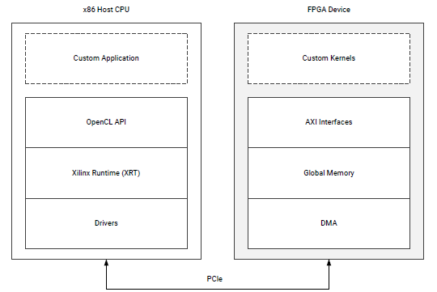

<a href="../../../docs/sdaccel-execution-model/README.md">English</a> | <a>日本語</a>

<table>
 <tr>
   <td align="center"><h1>2019.1 SDAccel™ 開発環境チュートリアル</h1>
   <a href="https://github.com/Xilinx/SDAccel-Tutorials/branches/all">その他のバージョンを表示</a>
   </td>
 </tr>
 <tr>
 <td align="center"><h1>SDAccel 入門コース</h1>
 </td>
 </tr>
</table>

# SDAccel 実行モデル

## 概要

SDAccel™ アクセラレーション アプリケーションは、ソフトウェア プログラムとハードウェア アクセラレーションされたカーネルを含む FPGA バイナリの 2 つのコンポーネントで構成されます。これら 2 つのコンポーネント間の制御および通信は、ザイリンクス ランタイム ライブラリ (XRT) で管理されます。

* C/C++、および OpenCL™ のような API 呼び出しを使用して記述されたソフトウェア プログラムは x86 サーバーで実行されます。
* ハードウェア アクセラレーションされたカーネルは Alveo™ アクセラレータ カード上のザイリンクス FPGA デバイスで実行されます。

ザイリンクス ランタイム (XRT) で管理されるソフトウェア プログラム内の API 呼び出しにより、ホストとデバイス間でデータが転送され、カーネルが実行され、最適に同期されます。ホスト x86 サーバーとアクセラレータ カード間の通信には、PCIe バスが使用されます。データは、ソフトウェア プログラムから指定したカーネルに直接送信されるか、グローバル メモリ (ソフトウェアとカーネルの両方からアクセスされる共有メモリ空間) に含められます。

次の図は、このアクセラレーション プラットフォームの一般的な構造を示しています。

右側の FPGA ハードウェア プラットフォームにはハードウェアアクセラレーションされたカーネル、グローバル メモリとメモリ転送用の DMA が含まれます。カーネルは 1 つまたは複数のグローバル メモリ インターフェイスを含むことができ、プログラマブルです。

SDAccel 環境実行モデルでは、次が実行されます。

1. ホスト アプリケーションは PCIe インターフェイスを介して、カーネルで必要とされるデータを接続されたデバイスのグローバル メモリに書き込みます。
2. ホスト アプリケーションは、その入力パラメーターを使用してカーネルを設定します。
3. ホスト アプリケーションは FPGA のカーネル関数の実行を開始します。
4. カーネルは必要な計算をし、グローバル メモリからのデータの読み出しを必要に応じて実行します。
5. カーネルがグローバル メモリにデータを書き戻し、ホストにタスクが終了したことを通知します。
6. ホスト アプリケーションは、グローバル メモリからホスト メモリにデータを転送するか、別のカーネルにデータを送信して処理します。

## 次のステップ

開発システムをインストールして設定し、SDAccel 開発環境を使用してホスト プログラムとハードウェア カーネルをビルドします。Alveo アクセラレータ カードを開発システムまたは運用システムにインストールして設定します。[詳細...](../../../docs/alveo-getting-started/README.md)

 

<b><a href="../../README.md">メイン ページに戻る</a> — <a href="../sdaccel-getting-started/README.md">入門コースの初めに戻る</a></b>

 

Copyright&copy; 2019 Xilinx

