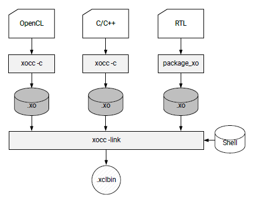

<table>
 <tr>
   <td align="center"><h1>2019.1 SDAccel™ Development Environment Tutorials</h1>
   <a href="https://github.com/Xilinx/SDAccel-Tutorials/branches/all">See other versions</a>
   </td>
 </tr>
 <tr>
 <td align="center"><h1>Essential Concepts for Building and Running the Accelerated Application</h1>
 </td>
 </tr>
</table>

# 1. Building an Application

## Introduction

As described in [SDAccel Execution Model](/docs/sdaccel-execution-model/), an accelerated application consists of a software program running on an x86 server, and the accelerated kernels running on an Alveo accelerator card and Xilinx FPGA. The sources for both of these need to be built (compiled and linked) separately. For additional details see the *SDAccel Environment User Guide* ([UG1023](https://www.xilinx.com/html_docs/xilinx2019_1/sdaccel_doc/itd1534452174535.html)).

This tutorial describes how to build both the software and hardware portions of your design using the Xilinx® XCPP and XOCC compilers. It describes various command line options, including how to specify a target platform, and building for hardware or software emulation.

Reference files are provided in the [./reference_files](./reference-files) directory for use with this tutorial.

>**IMPORTANT:** Before running the example commands, ensure you have set up the SDx tools, platform, and runtime by running the following commands, as described in the *SDAccel Development Environment Release Notes, Installation, and Licensing Guide* ([UG1238)](https://www.xilinx.com/html_docs/xilinx2019_1/sdaccel_doc/yrc1534452173645.html).
>
>   ```bash
>    #setup Xilinx SDx tools. XILINX_SDX and XILINX_VIVADO will be set in this step.
>    source <SDX_install_path>/settings64.sh
>    #Setup Xilinx runtime. XILINX_XRT will be set in this step.
>    source <XRT_install_path>/setup.sh
>   ```

## Building the Software

The software program is written in C/C++, and uses OpenCL™ API calls to communicate with and control the accelerated kernels. It is built using the standard GCC compiler or using the XCPP utility, which is a wrapper around GCC.  Each source file is compiled to an object file (.o) and linked with the Xilinx runtime (XRT) shared library to create the executable. For details on GCC and associated command line options, refer to [Using the GNU Compiler Collection (GCC)](https://gcc.gnu.org/onlinedocs/gcc/).

1. **Compilating the Software Program**

   To compile the host application, use the `-c` option with a list of the host source files.  
Optionally, the output object file name can be specified with the `-o` option as shown below.

    ```bash
    xcpp ... -c <source_file_name1> ... <source_file_nameN> -o <object_file_name> -g
    ```

2. **Linking the Software Program**

    To link the generated object files, use the `-l` option and object input files as follows.

     ```bash
     xcpp ... -l <object_file1.o> ... <object_fileN.o> -o <output_file_name>
     ```

   >**TIP:** Host compilation and linking can be integrated into one step which does not require the `-c` and `-l` options. Only the source input files are required as shown below.
   >
   >`xcpp ... <source_file_name1> ... <source_file_nameN> ... -o <output_file_name>`

3. **Required Flags**

   You will need to specify include paths and library paths for the XRT and Vivado tools:  

   1. Use the `-I` option to specify the include directories: `-I$XILINX_XRT/include -I$XILINX_VIVADO/include`
   2. Use the `-L` option to specify directories searched for `-l` libraries: `-L$XILINX_XRT/lib`
   3. Use the `-l` option to specify libraries used during linking: `-lOpenCL -lpthread -lrt -lstdc++`

4. **Complete Command**

   The complete command to build, link, and compile the host program in one step, from the `./reference_files/run` folder, will look like the following.

    ```bash
    $XILINX_SDX/bin/xcpp -I$XILINX_XRT/include/ -I$XILINX_VIVADO/include/ -Wall -O0 -g -std=c++14 \
    ../src/host.cpp  -o 'host'  -L$XILINX_XRT/lib/ -lOpenCL -lpthread -lrt -lstdc++
    ```

   >**Command Options and Descriptions**
   >
   >* `-I../libs`: Include directory:
   >* `-I$XILINX_XRT/include/`: Include directory
   >* `-I$XILINX_VIVADO/include/`: Include directory
   >* `-Wall`: Enable all warnings
   >* `-O0`: Optimization option (execute the least optimization)
   >* `-g`: Generate debug info
   >* `-std=c++14`: Language Standard (define the C++ standard, instead of the include directory)
   >* `../src/host.cpp`: Source files
   >* `-o 'host'`: Output name
   >* `-L$XILINX_XRT/lib/`: Look in XRT library
   >* `-lOpenCL`: Search the named library during linking.
   >* `-lpthread`: Search the named library during linking.
   >* `-lrt`: Search the named library during linking.
   >* `-lstdc++`: Search the named library during linking.

## Building the Hardware

Next, you need to build the kernels that run on the hardware accelerator card.  Building the kernels, like building the host application, requires compiling and linking. The hardware kernels can be coded in C/C++, OpenCL C, or RTL. The C/C++ and OpenCL C kernels are compiled using the XOCC compiler, while RTL-coded kernels are compiled using the Xilinx `package_xo` utility.

For details on both `xocc` and `package_xo`, refer to the *SDx Command and Utility Reference Guide* ([UG1279](https://www.xilinx.com/html_docs/xilinx2019_1/sdaccel_doc/ckx1534452174973.html)). Regardless of how each kernel is compiled, both methods generate a Xilinx object file (XO) as an output.

The object files are subsequently linked with the shell (hardware platform) through `xocc` to create the FPGA binary file, or xclbin file.

The following figure shows the compiling and linking flow for the various coded hardware kernels.  
    

This tutorial is limited to 'xocc' compilation and does not consider RTL kernels. For details on building RTL kernels, see the [Getting Started with RTL Kernels](docs/getting-started-rtl-kernels) tutorial.

### Hardware Compilation

In hardware compilation, you are compiling hardware kernel source files through the XOCC `-c` compiler option. While XOCC has many command options, at minimum you must specify the source files, the targeted platform, and the build target. For a complete list of XOCC options, refer to the  *SDx Command and Utility Reference Guide* ([UG1279](https://www.xilinx.com/html_docs/xilinx2019_1/sdaccel_doc/ckx1534452174973.html)).

Optionally, the `-k` or `--kernel` argument can be used to specify the kernel name within the kernel source file to compile, as follows.

`xocc … -k <kernel_name>  <kernel_source_file> … <kernel_source_file>`

The targeted platform must be specified during both compile and linking stages, and is specified through the `--platform` option as follows.

`xocc … --platform <platform_target>`

Finally, the build target is specified with the `-t` option.
`xocc … -t <build_target>`

There are three different build targets; two emulation targets used for debug and validation purposes, and one hardware target used to generate the actual binary needed to run on the FPGA.  

These build target configurations options are:

* `xocc … -t sw_emu`
* `xocc … -t hw_emu`
* `xocc … -t hw`

In Software Emulation (`sw_emu`), both the host application code and the kernel code are compiled to run on the x86 processor. This allows iterative algorithm refinement through fast build-and-run loops. This target is useful for identifying syntax errors, performing source-level debugging of the kernel code running together with application, and verifying the behavior of the system.  For RTL kernels, software emulation can be supported if a C model is associated with the kernel.  When a C model is not available, then hardware emulation must be used to debug the kernel code.

For Hardware Emulation (`hw_emu`) kernel code is compiled into a hardware model, which is run in a hardware simulator, while the rest of the system uses a C simulator. Building and running takes longer but provides a detailed, cycle-accurate view of kernel activity. This target is useful for testing the functionality of the logic that will run in the FPGA and for getting initial performance estimates.

Finally, when the target is set to System (`hw`), the kernel code is synthesized and compiled to generate a binary to run on the FPGA.

The following command compiles the kernel into a *software emulation* target, from the `./reference_files/run` folder.

  ```bash
  xocc -t sw_emu --platform xilinx_u200_xdma_201830_1 -g -c -k mmult -I'../src' -o'mmult.sw_emu.xilinx_u200_xdma_201830_1.xo' '../src/mmult.cpp'
  ```
  
>**Command Options and Descriptions**
>
>* `-c`: Compile the kernel
>* `-g`: Generate debug info
>* `--platform xilinx_u200_xdma_201830_1`: Target the xilinx_u200 platform
>* `-t sw_emu`: Target software emulation
>* `-k mmult`: Name the Kernel krnl_vadd
>* `../src/mmult.cpp`: Specify source files
>* `-o mmult.sw_emu.xilinx_u200_xdma_201830_1.xo`: Specify the XO output file name

### Hardware Linking

During hardware linking, you will link one or more kernels with the platform to create an output binary container xclbin file. The XOCC `-l` option is used to link the hardware kernels. Similar to compiling, linking requires several options including specifying the XO object files, the platform, and the build target. For the available linking options, refer to *SDx Command and Utility Reference Guide* ([UG1279](https://www.xilinx.com/html_docs/xilinx2019_1/sdaccel_doc/ckx1534452174973.html)) The platform and build target options used during linking must match those used during compilation.

The XO object files are specified on the xocc command by directly listing the object files. Multiple object files can be added.

`xocc … <kernel_xo_file.xo> … <kernel_xo_file.xo>`

You can also specify the number of kernel instances (compute units (CUs)) to create during the linking process. The instances of a kernel can be specified in the xclbin file using the `--nk` option, as shown below.

`xocc ... --nk <kernel_name>:<compute_units>:<kernel_name1>:…:<kernel_nameN>`

 >**TIP:** The instance name (`kernel_name1...') is optional, and automatically defined if not specified.

You can also specify the name of the generated output file using the `-o` option. The output file in the link stage will be xclbin file and should be named accordingly.

`xocc ... -o <xclbin_name>.xclbin`

Now, link the hardware. Notice that you must specify the platform and target as previously to match the target in the hardware compile step. Run the following command.

  ```bash
  xocc -t sw_emu --platform xilinx_u200_xdma_201830_1 -g -l --nk mmult:1:mmult_1 -o'mmult.sw_emu.xilinx_u200_xdma_201830_1.xclbin' mmult.sw_emu.xilinx_u200_xdma_201830_1.xo
  ```

>**Command Options and Descriptions**
>
>* `-l`: Link the kernel
>* `-g`: Generate debug info
>* `--platform xilinx_u200_xdma_201830_1`: Specify the platform
>* `-t sw_emu`: Target software emulation
>* `--nk mmult:1:mmult_1`: Create one CU called mmult_1
>* `mmult.sw_emu.xilinx_u200_xdma_201830_1.xo`: Input object file
>* `-o mmult.sw_emu.xilinx_u200_xdma_201830_1.xclbin`: Specify the XCLBIN output file name

### Building for Hardware Emulation & the Hardware System

To build the hardware for *hardware emulation*, or for targeting the Alveo accelerator card *system*, change the `-t` option specifying the *<build_target>* from **sw_emu** to **hw_emu** for hardware emulation, or **hw** to build for the accelerator card.

The compile and link XOCC commands for both *hardware emulation* and *system* build targets are provided below.

* **Hardware Emulation Build**

   ```bash
   xocc -t hw_emu --platform  xilinx_u200_xdma_201830_1 -g -c -k mmult -I'../src' -o'mmult.hw_emu.xilinx_u200_xdma_201830_1.xo' '../src/mmult.cpp'
    xocc -t hw_emu --platform xilinx_u200_xdma_201830_1 -g -l --nk mmult:1:mmult_1 -o'mmult.hw_emu.xilinx_u200_xdma_201830_1.xclbin' mmult.hw_emu.xilinx_u200_xdma_201830_1.xo
  ```

* **System Build**

   >**IMPORTANT:** Because of the FPGA binary file synthesis and implementation, compiling and linking for the hardware target can take significant time.

   ```bash
     xocc -t hw --platform xilinx_u200_xdma_201830_1 -c -k mmult -I'../src' -o'mmult.hw.xilinx_u200_xdma_201830_1.xo' '../src/mmult.cpp'
     xocc -t hw --platform xilinx_u200_xdma_201830_1 -l --nk mmult:1:mmult_1 -o'mmult.hw.xilinx_u200_xdma_201830_1.xclbin' mmult.hw.xilinx_u200_xdma_201830_1.xo
   ```

### Reviewing Hardware Build Reports

For both the compilation and linking stages, HTML-based design Guidance reports are generated. The reports list the command used to compile/link, a report summary, and any violations.

For *hardware emulation* and *system builds* targeted builds, a `system_estimate_<kernel_name>.<build_target>.<dsa_name>.xtxt` report file is also automatically generated for both the compilation and linking stages. It provides the estimated FPGA resource usage and estimated frequency of the hardware accelerated kernel.

* The compilation reports are located in the following directory.

   ```
   ./_x/reports/<kernel_name>.<build_target>.<dsa_name>
  ```

* The linking reports are located in the following directory.

   ```
  ./_x/reports/link
   ```

To open the reports, change directory to the associated directory, and open the HTML Guidance report. If the target build was for *hw_emu* or *system builds*, the targeted builds open the XTXT file in a text editor.

* The following figure shows an example of hardware compilation HTML report. A similar report is generated during linking.

    
    

* The following figure shows an example of the `system_estimate.xtxt` compilation report, found in the `./_x/reports/links` folder. A similar report is generated during linking.

     


### Putting it All Together

The following steps summarize how to build both the software and hardware targeting software emulation using the source files in this lab.

1. Set up the SDx tools, platform, and runtime.

   ```bash
   #setup Xilinx SDx tools, XILINX_SDX and XILINX_VIVADO will be set in this step. source <SDX install path>/settings64.sh. for example:
   source /opt/Xilinx/SDx/2019.1/settings64.sh
   #Setup runtime. XILINX_XRT will be set in this step
   source /opt/xilinx/xrt/setup.sh
   #change to the working directory
   cd ./reference-files/run
   ```

2. Build the host software.

   ```bash
   xcpp -I$XILINX_XRT/include/ -I$XILINX_VIVADO/include/ -Wall -O0 -g -std=c++14 ../src/host.cpp  -o 'host'  -L$XILINX_XRT/lib/ -lOpenCL -lpthread -lrt -lstdc++
   ```

3. Build the hardware. Select the target (software emulation, hardware emulation, or system), and run the associated commands.

   * Target for *software emulation*

   ```bash
   xocc -t sw_emu --platform xilinx_u200_xdma_201830_1 -g -c -k mmult -I'../src' -o'mmult.sw_emu.xilinx_u200_xdma_201830_1.xo' '../src/mmult.cpp'
   xocc -t sw_emu --platform xilinx_u200_xdma_201830_1 -g -l --nk mmult:1:mmult_1 -o'mmult.sw_emu.xilinx_u200_xdma_201830_1.xclbin' mmult.sw_emu.xilinx_u200_xdma_201830_1.xo
   ```

   * Target for *hardware emulation*

   ```bash
   xocc -t hw_emu --platform  xilinx_u200_xdma_201830_1 -g -c -k mmult -I'../src' -o'mmult.hw_emu.xilinx_u200_xdma_201830_1.xo' '../src/mmult.cpp'
   xocc -t hw_emu --platform xilinx_u200_xdma_201830_1 -g -l --nk mmult:1:mmult_1 -o'mmult.hw_emu.xilinx_u200_xdma_201830_1.xclbin' mmult.hw_emu.xilinx_u200_xdma_201830_1.xo
   ```

   * Target for *system*

   ```bash
   xocc -t hw --platform xilinx_u200_xdma_201830_1 -c -k mmult -I'../src' -o'mmult.hw.xilinx_u200_xdma_201830_1.xo' '../src/mmult.cpp'
   xocc -t hw --platform xilinx_u200_xdma_201830_1 -l --nk mmult:1:mmult_1 -o'mmult.hw.xilinx_u200_xdma_201830_1.xclbin' mmult.hw.xilinx_u200_xdma_201830_1.xo
   ```

## Next Steps

After successfully building a design, you will want to run emulation to debug and optimize the design.

* The [Running Software and Hardware Emulation](./Emulation.md) lab details how to run software and hardware emulation.
* If you have a Xilinx Alveo card, you can also run the application directly on hardware by following the details in the [Executing in Hardware](./HardwareExec.md) lab.

</br>
<hr/>
<p align="center"><b><a href="/docs/sdaccel-getting-started/">Return to Getting Started Pathway</a> — <a href="./README.md">Return to Start of Tutorial</a></b></p>

<p align="center"><sup>Copyright&copy; 2019 Xilinx</sup></p>