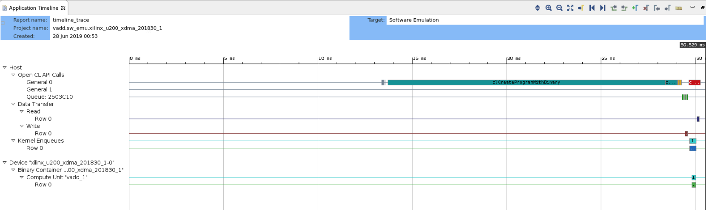
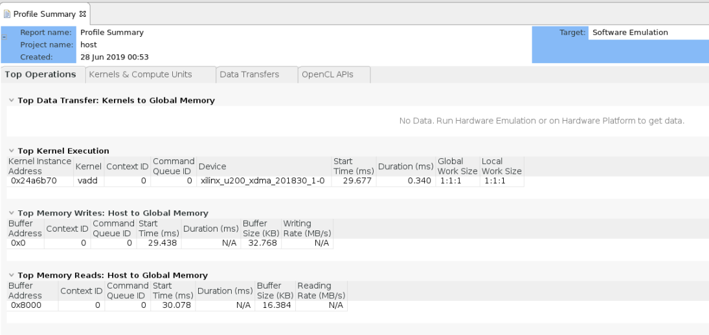
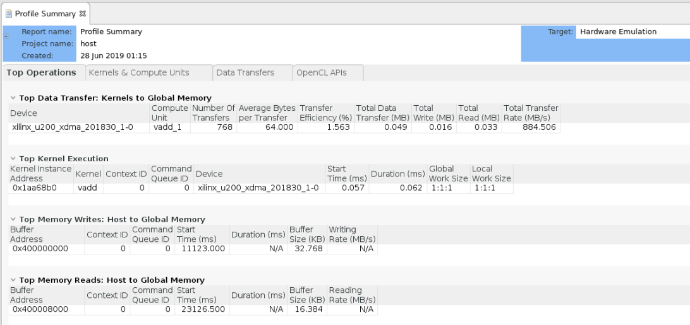
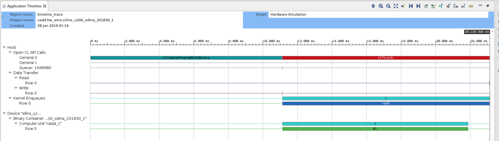

<table>
 <tr>
   <td align="center"><h1>2019.1 SDAccel™ Development Environment Tutorials</h1>
   <a href="https://github.com/Xilinx/SDAccel-Tutorials/branches/all">See other versions</a>
   </td>
 </tr>
 <tr>
 <td align="center"><h1>Getting Started with C/C++ Kernels</h1>
 </td>
 </tr>
</table>

# Introduction  

This tutorial walks you through the steps of building a basic HLS C kernel design using the SDAccel™ environment makefile flow and learning some of the features that enable you to do performance profiling and optimization.  

# Tutorial Overview

This tutorial is based on the Xilinx SDAccel Examples on GitHub, specifically the Hello World example. For more information related to the GitHub examples, refer to the _SDAccel Profiling and Optimization Guide_ ([UG1207](https://www.xilinx.com/cgi-bin/docs/rdoc?v=2019.1;d=ug1207-sdaccel-optimization-guide.pdf)).

# Prerequisites

This tutorial uses:

* BASH Linux shell commands
* 2019.1 SDx release and the *xilinx_u200_xdma_201830_1* platform.  
If necessary, it can be easily extended to other versions and platforms.

>**IMPORTANT:**  
>
> * Before to running any of the examples, make sure you have installed Xilinx Runtime (XRT) and the SDAccel development environment as described in the *SDAccel Development Environment Release Notes, Installation, and Licensing Guide* ([UG1238)](https://www.xilinx.com/support/documentation/sw_manuals/xilinx2019_1/ug1238-sdx-rnil.pdf).  
>* If you will run applications on the Alveo card, ensure the card and software drivers have been correctly installed by following the instructions in the *Getting Started with Alveo Data Center Accelerator Cards Guide* ([UG1301](https://www.xilinx.com/support/documentation/boards_and_kits/accelerator-cards/ug1301-getting-started-guide-alveo-accelerator-cards.pdf)).

## Accessing the Tutorial Reference Files

1. To access the reference files, type the following into a terminal: `git clone https://github.com/Xilinx/SDAccel-Tutorials`.
2. Navigate to `SDAccel-Tutorials-master/docs/getting-started-c-kernels/reference-files`.

# Prepare and Set Up the SDAccel Environment

In this step, set up the SDAccel environment to run in command line, and get familiar with the reference design files.

1. Launch a terminal window, and source the settings scripts under the SDAccel install directory using the following command.

   ```c
   source <SDx_install_location>/<version>/settings64.sh
   ```

1. Change directory into the working directory for this tutorial.

   ```
   cd SDAccel-Tutorials-master/docs/getting-started-c-kernels/reference-files
   ```

1. The source code are under `src` folder. Run `ls` command and check the files.

   ```C
   $ ls src
   host.cpp    vadd.cpp    xcl2.hpp    xcl2.cpp
   ```

   * The `vadd.cpp` file is the kernel source file.
   * The `host.cpp` file is the host code.
   * The `xcl2.hpp` and `xcl2.cpp` are OpenCL™ APIs that are used in host code.

   You can open those two files and browse their contents.

## Initial Design and Makefile Exploration

In this step, you will learn about the makefile syntax and usage. Under `reference-files` directory, use the pre-built makefile named `Makefile` to:

* Build and run the design in software emulation, hardware emulation, and system run.
* Generate reports for performance profiling.

1. Open the `Makefile` in a text editor as follows.

   ```
   vim Makefile
   ```

2. Familiarize yourself with the content structure and syntax.

   The file itself makes references to a few generic makefiles used by all Xilinx SDAccel examples. The files are called by the `include` command. You can open the common makefiles, and review their contents.

3. In the `Makefile`, scroll down to line 31, which defines the `TARGETS` parameter.

   ```
   TARGETS:= hw
   ```

   The `TARGETS` parameter is used to define the default build target for the XOCC compiler. In this lab, the parameter is set to `hw` (system build) by default, but you can change it to another value when executing the command.

4. Line 36 shows that a common makefile `utils.mk` is included in this example design. Open the `utils.mk` file, and familiarize yourself with its contents.

   The following code snippet shows the `utils.mk` file, which contains several XOCC flags to define report type, profiling, and debugging mode.

   ```
   # By Default report is set to none, no report will be generated  
   # 'estimate' for estimate report generation  
   # 'system' for system report generation  
   REPORT:=none
   PROFILE ?= no
   DEBUG ?=no

   ifneq ($(REPORT),none)  
   CLFLAGS += --report $(REPORT)  
   endif

   ifeq ($(PROFILE),yes)
   CLFLAGS += --profile_kernel data:all:all:all
   endif

   ifeq ($(DEBUG),yes)
   CLFLAGS += --dk protocol:all:all:all
   endif
   ```

   >**NOTE:** `REPORT`, `PROFILE` and `DEBUG` are input flags (parameters) for the `make` command in the terminal. Notice that the `CLFLAGS` builds a long list of XOCC command line flags to be used.

5. Close the `utils.mk` file, and go back to the `Makefile`.

6. Review the section between lines 49 and 71.  
This section defines the source code location, XCPP, and XOCC flags for building host executables, and binary containers, etc. Here, you can customize the flags. For the purposes of this tutorial, keep the flags as is.  
   From line 75 and beyond, it defines the different rules to build and run with this makefile.

7. Close `Makefile`.

## Run Software Emulation

Now that you understand the `Makefile` structure and syntax, compile the code to run software emulation.

1. First, compile the application for Software Emulation on the *xilinx_u200_xdma_201830_1* platform, and generate an estimate report using the following command.

   ```
   make all REPORT=estimate TARGETS=sw_emu DEVICES=xilinx_u200_xdma_201830_1
   ```

   There are three parameters provided for executing the makefile. We define the generated report type, build target and device. You may also set the `REPORT` and `DEVICES` parameters to other valid values.

   Because you selected `all`, therefore all the commands specified under `all` rule will be executed as long as it has not been done before.
   >**NOTE:** The makefile execution model is incremental.

   After the build process is complete, the following four primary files are generated:

   * `host`: Host executable
   * `xclbin/vadd.sw_emu.xilinx_u200_xdma_201830_1.xclbin`: Binary container
   * `_x.sw_emu.xilinx_u200_xdma_201830_1/vadd/reports/vadd.sw_emu.xilinx_u200_xdma_201830_1/system_estimate_vadd.sw_emu.xilinx_u200_xdma_201830_1.xtxt`: System estimate report
   * `emconfig.json`: Emulation support file

1. To run the host application in Software Emulation, use the following command.

   ```
   make check PROFILE=yes TARGETS=sw_emu DEVICES=xilinx_u200_xdma_201830_1
   ```

   >**NOTE:** Ensure that value for the `DEVICES` parameter specified is the same as what was used for compilation in the **Initial Design and Makefile Exploration** section.

   If host application completes successfully, the following messages are displayed in a terminal window.

   ```
   ...
   XCL_EMULATION_MODE=sw_emu ./host ./xclbin/vadd.sw_emu.xilinx_u200_xdma_201830_1.xclbin
   Found Platform
   Platform Name: Xilinx
   INFO: Reading ./xclbin/vadd.sw_emu.xilinx_u200_xdma_201830_1.xclbin
   Loading: './xclbin/vadd.sw_emu.xilinx_u200_xdma_201830_1.xclbin'
   TEST PASSED
   sdx_analyze profile -i profile_summary.csv -f html
   INFO: Done writing profile_summary.html
   ```

1. Next, generate additional reports. To generate additional reports, you need to add specific options in the `xrt.ini` file. For example, the `timeline_trace` flag can be set to generate the Timeline Trace report.

   ```
   [Debug]
   timeline_trace = true
   profile = true
   ```

   To see its effect, re-run the host application:

   ```
   make check PROFILE=yes TARGETS=sw_emu DEVICES=xilinx_u200_xdma_201830_1
   ```

   After host application completes running, a CSV-based Timeline Trace report named `timeline_trace.csv` is generated.

1. To view the Timeline Trace report in the SDAccel environment GUI, use the following command to convert the CSV file into a WDB file.

   ```
   sdx_analyze trace timeline_trace.csv
   ```

   Then, open it in the SDAccel GUI using following command.

   ```
   sdx -workspace workspace -report timeline_trace.wdb
   ```

1. Select an appropriate folder to create a new workspace.
   The following figure shows an example Timeline Trace report.

   

1. Browse the Timeline Trace report. There are two sections shown in the waveform, Host and Device.

   * Under the Host tab, different types of activities are categorized as OpenCL API calls, Data transfers and Kernel. You can zoom in the waveform to see each activity and the measured runtime.
   * Under the Device tab, the activities of compute units on FPGA are shown. In this lab, there is only one CU therefore only one row is shown.

1. To view the Profile Summary report in the SDAccel environment GUI, convert the CSV-based file to an XPRF format using following command.

   ```
   sdx_analyze profile profile_summary.csv -f protobuf
   ```

   To view the report in the SDAccel environment GUI, use the following command.

   ```
   sdx -workspace workspace -report profile_summary.xprf
   ```

   The following figure shows an example of the Profile Summary report:

   

   >**NOTE**: Software emulation does not provide all the profiling information, such as the data transfer between kernel and global memory. This information is available in hardware emulation and system run.

1. After browsing the Profile Summary report, close the SDAccel environment GUI.

## Run Hardware Emulation

Now that you have completed Software Emulation, you can run Hardware Emulation.

1. To do this, simply modify the `make` command as follows.

   ```
   make all REPORT=estimate TARGETS=hw_emu DEVICES=xilinx_u200_xdma_201830_1
   ```

   When you explicitly define the `TARGETS`, it overwrites the default in the makefile.

   >**NOTE**: Hardware emulation takes longer to compile than software emulation.

1. After compilation is over, run the host application in Hardware Emulation mode.

   ```
   make check TARGETS=hw_emu DEVICES=xilinx_u200_xdma_201830_1
   ```

   The output is shown in the following log. You will notice that it looks similar to the log for Software Emulation. The difference is that now the kernel-DDR transfer statistics data is displayed.

   ```
   ...
   XCL_EMULATION_MODE=hw_emu ./host ./xclbin/vadd.hw_emu.xilinx_u200_xdma_201830_1.xclbin
   Found Platform
   Platform Name: Xilinx
   INFO: Reading ./xclbin/vadd.hw_emu.xilinx_u200_xdma_201830_1.xclbin
   Loading: './xclbin/vadd.hw_emu.xilinx_u200_xdma_201830_1.xclbin'
   INFO: [HW-EM 01] Hardware emulation runs simulation underneath. Using a large data set will result in long simulation times. It is recommended that a small dataset is used for faster execution. The flow uses approximate models for DDR memory and interconnect and hence the performance data generated is approximate.
   TEST PASSED
   INFO: [SDx-EM 22] [Wall clock time: 07:38, Emulation time: 0.119409 ms] Data transfer between kernel(s) and global memory(s)
   vadd_1:m_axi_gmem-DDR[1]          RD = 32.000 KB              WR = 16.000 KB
   ```

1. To view the Profile Summary and Timeline Trace reports in the GUI, convert the CSV files into XPRF and WDB files using the following commands.

   ```
   sdx_analyze profile profile_summary.csv -f protobuf
   sdx_analyze trace timeline_trace.csv
   ```

1. Then, use the following commands to open up the reports in SDAccel GUI.

      ```
      sdx -workspace workspace -report profile_summary.xprf
      sdx -workspace workspace -report timeline_trace.wdb
   ```

   The following figure shows an example of Profile Summary report. Notice that  the kernel-DDR data transfer data is now listed.

   

   The following figure shows the Timeline Trace report. Normally, if you compare the hardware emulation result with software emulation result, you find that the duration time is much longer for kernel execution and data transfers, as it is more accurate than software emulation especially on the data transfer part.

   

## Run on the Hardware Platform

You have completed both Software Emulation and Hardware Emulation. Now, run the application on a hardware platform.

1. To compile the design for system run, use the following command.

   ```
   make all TARGETS=hw DEVICES=xilinx_u200_xdma_201830_1
   ```

   >**NOTE**:
   >
   >Building for system run takes the longest time, as it will run through the SDAccel environment and Vivado Design Suite hardware implementation flow to create the binary file for FPGA configuration.
   >
   >For this tutorial, use the u200 card as the target platform; however, the target platform can be changed to other SDAccel tool supported platforms.

1. Before running any designs on an acceleration card, install the board deployment software.

   You can find corresponding documents about how to install it on the Xilinx website. For example, to install on an Alveo card, refer to the *Getting Started with Alveo Data Center Accelerator Cards Guide* ([UG1301](https://www.xilinx.com/support/documentation/boards_and_kits/accelerator-cards/ug1301-getting-started-guide-alveo-accelerator-cards.pdf)).

1. After the card is installed successfully and step 1 is finished, use the following command to run the application.

   ```
   make check TARGETS=hw DEVICES=xilinx_u200_xdma_201830_1
   ```

1. After the application finishes successfully, to convert and view the reports, enter the following commands.

   ```
   sdx_analyze profile profile_summary.csv
   sdx_analyze trace timeline_trace.csv
   sdx -workspace workspace -report profile_summary.xprf
   sdx -workspace workspace -report timeline_trace.wdb
   ```

## Summary

After completing this tutorial, you should be able to do the following:

* Set up the SDAccel environment to run all commands in a terminal.
* Understand the `xcpp`, `xocc`, `emconfigutil`, `sdx_analyze profile`, `sdx_analyze trace` commands to generate the application, binary container, and emulation model.
* Run a makefile to compile an HLS C kernel and host code.
* View the generated files from emulation in a text editor or the SDAccel environment GUI.
* Set up the environment and deploy the design to be used with the hardware platform.

<hr/>
<p align="center"><sup>Copyright&copy; 2019 Xilinx</sup></p>
