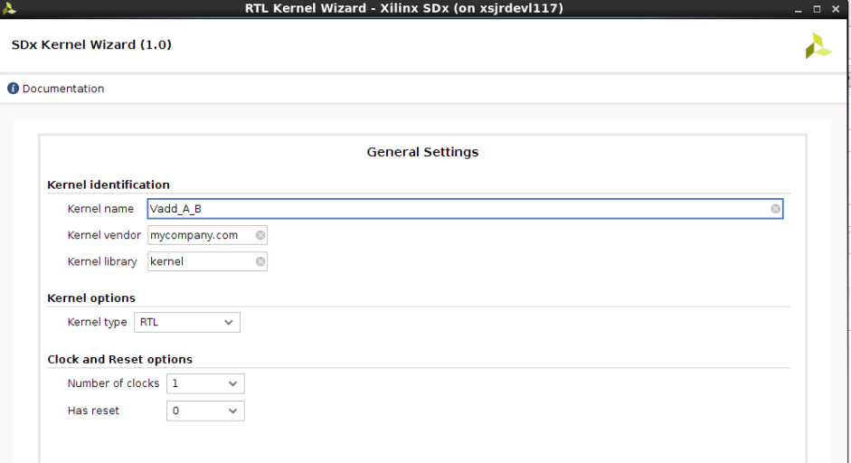
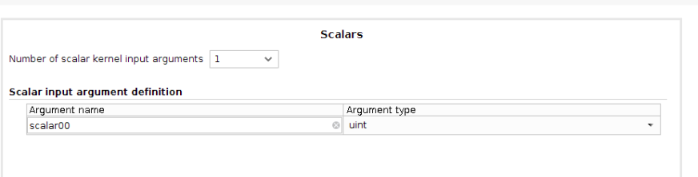
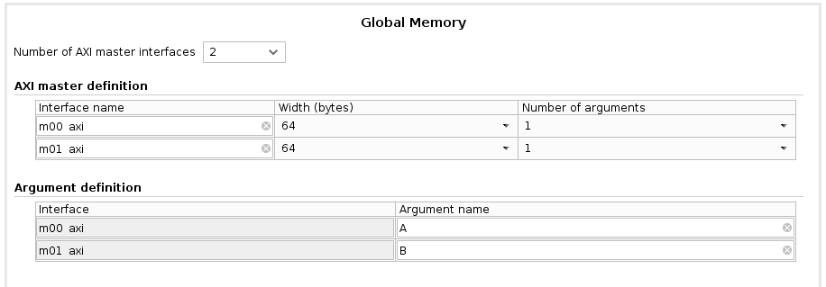
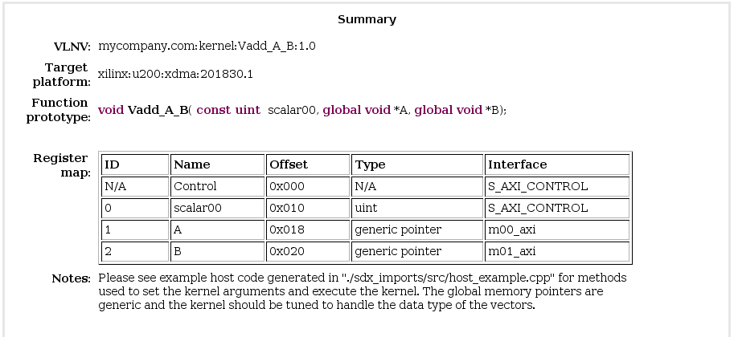
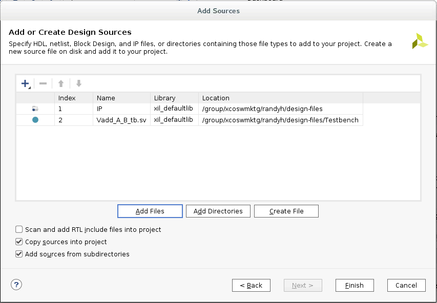
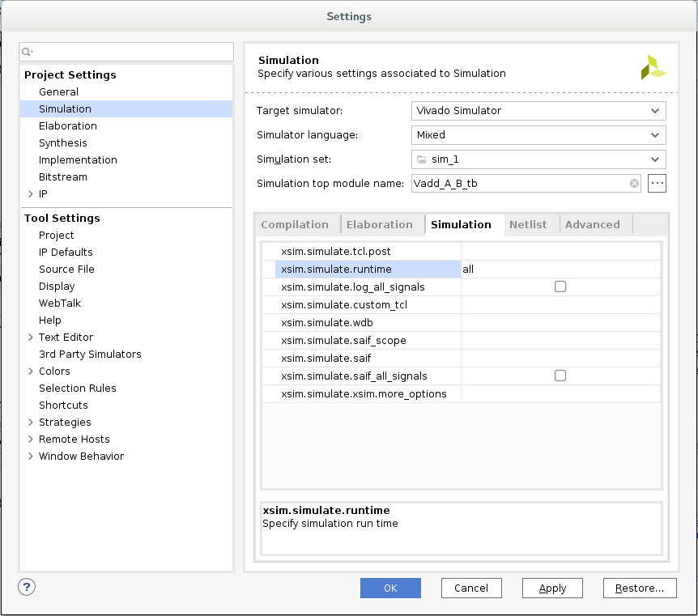
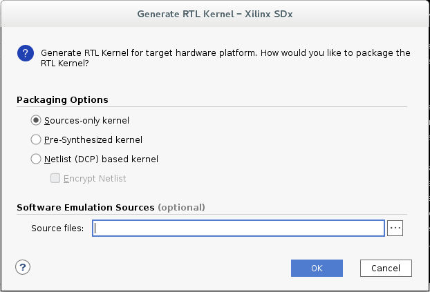

<table>
 <tr>
   <td align="center"><h1>2019.1 SDAccel™ Development Environment Tutorials</h1>
   <a href="https://github.com/Xilinx/SDAccel-Tutorials/branches/all">See other versions</a>
   </td>
 </tr>
 <tr>
 <td align="center"><h1>Getting Started with RTL Kernels</h1>
 </td>
 </tr>
</table>

# Introduction

This tutorial demonstrates how to package RTL IPs as acceleration kernels, and use them in the SDAccel environment in four simple steps:

1. Package an RTL block as Vivado® Design Suite IP.
2. Create a kernel description XML file.
3. Package the RTL kernel into a Xilinx Object (XO) file.
4. Use the SDAccel environment to program the RTL kernel onto the FPGA and run in Hardware or Hardware-Emulation.

# Tutorial Overview

RTL designs that fit certain software and hardware interface requirements can be packaged into a Xilinx Object (XO) file. This file can be linked into a binary container to create an xclbin file that the host code application uses to program the kernel into the FPGA.

This tutorial provides the following reference files:

- A simple vector accumulation example that performs a `B[i] = A[i]+B[i]` operation.
- A host application, which interacts with the kernel using OpenCL APIs:

  - The host creates ready/write buffers to transfer the data between the host and the FPGA.
  - The host enqueues the RTL kernel (executed on the FPGA), which reads the buffer of the DDR, performs `B[i] = A[i]+B[i]`, and then writes the result back to the DDR.
  - The host reads back the data to compare the results.

Using these reference files, the tutorial will guide you from the first step of creating an SDx™ project to the final step of building and running your project.

# Before You Begin

This tutorial uses:

* BASH Linux shell commands
* 2019.1 SDx release and the *xilinx_u200_xdma_201830_1* platform.  
If necessary, it can be easily extended to other versions and platforms.

>**IMPORTANT:**  
>
> * Before running any of the examples, make sure you have installed Xilinx Runtime (XRT) and the SDAccel development environment as described in the *SDAccel Development Environment Release Notes, Installation, and Licensing Guide* ([UG1238)](https://www.xilinx.com/html_docs/xilinx2019_1/sdaccel_doc/yrc1534452173645.html).  
>* If you will run applications on the Alveo card, ensure the card and software drivers have been correctly installed by following the instructions in the *Getting Started with Alveo Data Center Accelerator Cards Guide* ([UG1301](https://www.xilinx.com/support/documentation/boards_and_kits/accelerator-cards/ug1301-getting-started-guide-alveo-accelerator-cards.pdf)).

## Accessing the Tutorial Reference Files

1. To access the reference files, type the following into a terminal: `git clone https://github.com/Xilinx/SDAccel-Tutorials`.
2. Navigate to `SDAccel-Tutorials-master/docs/getting-started-rtl-kernels/reference-files`.

# Requirements for Using an RTL Design as an RTL Kernel

To use an RTL kernel within the SDAccel environment framework, it must meet both the SDAccel kernel execution model and the hardware interface requirements.

## Kernel Execution Model

RTL kernels use the same software interface and execution model as C/C++ kernels. They are seen by the host application as functions with a void return value, scalar arguments, and pointer arguments. For instance:

```C
void vadd_A_B(int *a, int *b, int scalar)
```

This implies that an RTL kernel has an execution model like that of a software function:

- It must start when called.
- It is responsible for processing the necessary results.
- It must send a notification when processing is complete.

More specifically, the SDAccel environment execution model relies on the following mechanics and assumptions:

- Scalar arguments are passed to the kernel through an AXI4-Lite slave interface.
- Pointer arguments are transferred through global memory (DDR, HBM, or PLRAM).
- Base addresses of pointer arguments are passed to the kernel through its AXI4-Lite slave interface.
- Kernels access pointer arguments in global memory through one or more AXI4 interfaces.
- Kernels are started by the host application through its AXI4-Lite interface
- Kernels must notify the host application when they completed the operation through its AXI4-Lite interface or a special interrupt signal.

## Hardware Interface Requirements

To comply with this execution model, the SDAccel environment requires that a kernel satisfies the following specific hardware interface requirements:

- One and only one AXI4-Lite slave interface used to access programmable registers (control registers, scalar arguments, and pointer base addresses).
  - Offset `0x00` - Control Register: Controls and provides kernel status
    - Bit `0`: **start signal**: Asserted by the host application when kernel can start processing data. Must be cleared when the **done** signal is asserted.
    - Bit `1`: **done signal**: Asserted by the kernel when it has completed operation. Cleared on read.
    - Bit `2`: **idle signal**: Asserted by this signal when it is not processing any data. The transition from Low to High should occur synchronously with the assertion of the **done** signal.
  - Offset `0x04`- Global Interrupt Enable Register: Used to enable interrupt to the host.
  - Offset `0x08`- IP Interrupt Enable Register: Used to control which IP generated signal is used to generate an interrupt.
  - Offset `0x0C`- IP Interrupt Status Register: Provides interrupt status
  - Offset `0x10` and above - Kernel Argument Register(s): Register for scalar parameters and base addresses for pointers.

- One or more of the following interfaces:
  - AXI4 master interface to communicate with global memory.
    - All AXI4 master interfaces must have 64-bit addresses.
    - The kernel developer is responsible for partitioning global memory spaces. Each partition in the global memory becomes a kernel argument. The base address (memory offset) for each partition must be set by a control register programmable through the AXI4-Lite slave interface.
    - AXI4 masters must not use Wrap or Fixed burst types, and they must not use narrow (sub-size) bursts. This means that AxSIZE should match the width of the AXI data bus.
    - Any user logic or RTL code that does not conform to the requirements above must be wrapped or bridged.
  - AXI4-Stream interface to communicate with other kernels.

If the original RTL design uses a different execution model or hardware interface, you must add logic to ensure that the design behaves in the expected manner and complies with interface requirements.

### Additional Information

For more information on the interface requirements for an SDAccel environment kernel, refer to the [Requirements for Using an RTL Design as an RTL Kernel](https://www.xilinx.com/html_docs/xilinx2019_1/sdaccel_doc/creating-rtl-kernels-qnk1504034323350.html#qbh1504034323531) section in the _SDAccel Environment User Guide_ ([UG1023](https://www.xilinx.com/html_docs/xilinx2019_1/sdaccel_doc/itd1534452174535.html)).

## Vector-Accumulate RTL IP

For this tutorial, the Vector-Accumulate RTL IP performing `B[i]=A[i]+B[i]` meets all the requirements described above and has the following characteristics:

- Two AXI4 memory mapped interfaces:
  - One interface is used to read A
  - One interface is used to read and write B
  - The AXI4 masters used in this design do not use wrap, fixed, or narrow burst types.
- An AXI4-Lite slave control interface:
  - Control register at offset `0x00`
  - Kernel argument register at offset `0x10` allowing the host to pass a scalar value to the kernel.
  - Kernel argument register at offset `0x18` allowing the host to pass the base address of A in global memory to the kernel
  - Kernel argument register at offset `0x1C` allowing the host to pass the base address of B in global memory to the kernel

These specifications serve as the inputs to the RTL Kernel Wizard. With this information, the RTL Kernel Wizard generates the following:

- An XML file necessary to package the RTL design as an SDAccel kernel XO file
- A sample kernel (RTL code, test bench, and host code) performing `A[i] = A[i] + 1`
- A Vivado Design Suite project for the kernel

As you continue through this tutorial, replace the sample kernel with the pre-existing Vector-Accumulate design, and package it as an XO file.

# Create an SDx Project

1. To launch the SDx development environment, use the `sdx` command in a Linux terminal window.  
The Workspace Launcher dialog box is displayed.  
  

2. Select a project location for your workspace.  

3. Click **Launch**.  
The Welcome window opens.  

   >**NOTE**: The Welcome window opens when you use the tool for the first time, or select **Help > Welcome**.

4. In the Welcome window, click **Create Application Project**.  
The New SDx Application Project window opens.  


5. Create a new SDx project:  
   1. Enter a project name, such as `rtl_ke_t2`.  
   2. Select **Use default location**.  
   3. Click **Next**.  
  The Platform page is displayed.  


6. Select `xilinx_u200_xdma_201830_1`, and then click **Next**.  
The Templates window opens, showing templates you can use to start building an SDAccel environment project. Unless you have downloaded other SDx examples, you should only see Empty Application and Vector Addition as available templates.  


   The hardware platform selection defines the project as an SDAccel or SDSoC™ environment project. In this case, you have selected an SDAccel environment acceleration platform, so the project will be an SDAccel project.

7. Select `Empty Application`, and click **Finish**.  
The new project wizard closes and takes you back to the main SDx environment
8. From the top menu bar of the SDx environment GUI, click **Xilinx**>**RTL Kernel Wizard** as shown in the following figure.  
  

    A Welcome to SDx RTL Kernel Wizard page is displayed with a summary of the kernel wizard features. Review the usage information.

# Configuration with the RTL Kernel Wizard

The RTL Kernel Wizard guides you through the process of specifying the interface characteristics for an RTL kernel. Using the RTL Kernel Wizard ensures that the RTL IP is packaged into a valid kernel that can be integrated into a system by the SDAccel environment. Using the wizard also has an added benefit of automating some necessary tasks for packaging the RTL IP into a kernel.

## General Settings

- **Kernel Identification**: Specifies the vendor, kernel name, and library, known as the "Vendor:Library:Name:Version" (VLNV) of the IP. The kernel name should match the top module name of the IP you are using for the RTL kernel.
- **Kernel Options**: Specifies the design type.
  - **RTL** (default): Generates the associated files in a Verilog format.
  - **Block design**: Generates a block design for the Vivado tools IP Integrator. The block design consists of a MicroBlaze™ subsystem that uses a block RAM exchange memory to emulate the control registers.
- **Clock and Reset Options**: Specifies the number of clocks used by the kernel and whether the kernel needs a top-level reset port.

1. For Kernel Identification, specify the kernel name as `Vadd_A_B`.

2. For the remaining options, keep the default values, and click **Next**.  


## Scalars

Scalar arguments are used to pass input parameters from the host application to the kernel. For the number of input arguments specified, a corresponding register is created to facilitate passing the argument from software to hardware. Each argument is assigned an ID value that is used to access that argument from the host application. This ID value can be found on the Summary page of the wizard.

- **Argument name**: Name of the argument.
- **Argument type**: Type of the scalar argument expressed as a native C/C++ datatype. For example: (u)char, (u)short or (u)int.

1. Keep the default values, and then click **Next**.  


## Global Memory

Global Memory is used to pass large data sets between the host and kernels, and between kernels to other kernels. This memory can be accessed by the kernel through an AXI4 master interface. For each AXI4 master interface, you can customize the interface name, data width, and the number of associated arguments.

- **Number of AXI master interfaces**: Specifies the number of AXI interfaces in the kernel.
- **AXI master definition**: Specifies the interface name, the data width (in bytes) and the number of arguments associated with each AXI4 interface.
- **Argument definition**: Specifies the pointer arguments assigned to each AXI4 interface. Each argument is assigned an ID value, that can be used to access the argument from the host application. This ID value assignment can be found on the Summary page of the wizard.

     

1. For Number of AXI master interfaces, select **2** since the Vector-Accumulate kernel has two AXI4 interfaces.

2. In the AXI master definition section:
   1. Do not modify the interface names.
   2. Do not modify the width.
   3. For Number of arguments, select **1** since each AXI4 interface is dedicated to a single pointer argument.

3. In the Argument definition section, under Argument name:
   1. For m00_axi, enter `A`.  
   Dataset A is accessed through this AXI4 interface.
   2. For m01_axi, enter `B`.  
   Dataset B is accessed through this AXI4 interface.  

      The settings should be the same as the above screen capture.  

4. Click **Next**.  
The Summary page is displayed.

## Example Summary Page



- **Target platform**: Specifies what platform the RTL kernel will be compiled for. The RTL kernel must be recompiled to support different platforms.
- **Function prototype**: Conveys what a kernel call would be like if it was a C function.
- **Register map**: Displays the relationship between the host software ID, argument name, hardware register offset, datatype, and associated AXI interface.

1. Before generating the kernel, review the summary page for correctness.

   The RTL Kernel Wizard uses the specification captured through the various steps and summarized in the Summary page to generate:

   - A kernel description XML file.

     - The [kernel.xml](./reference-files/src/xml/kernel.xml) file specifies the attributes you defined in the wizard  needed by the runtime and SDAccel environment flows, such as the register map.
   - A sample kernel called VADD implementing `A[i]=A[i]+1`, including:
     - RTL code
     - Verification test bench
     - Host code
     - A Vivado Design Suite project for the VADD sample kernel

2. To launch Vivado Design Suite to package the RTL IP and create the kernel, click **OK**.

# Vivado Design Suite — RTL Design

When the Vivado Design Suite GUI opens, the Sources window displays the source files that were automatically generated by the RTL Kernel Wizard.

## Remove the Example Files

Before adding your design files to the project, you need to remove the example files generated by the RTL Kernel Wizard.

1. In the Vivado Design Suite GUI, in the Sources window, select **Compile Order** > **Synthesis**, and then expand the Design Sources tree.

2. Select all eight source files, right-click, and then select **Remove File from Project...`**.

3. In the displayed Remove Sources dialog box, to remove the files from the project, click **OK**.

   The Invalid Top Module dialog box opens.

4. To continue, click **OK**.

   >**NOTE**: You have removed the automatically-generated RTL files from the RTL kernel project, which means you are ready to add your own RTL IP files back into the project. The RTL IP files have been provided for you in this tutorial, but this is the point where you would insert your own RTL IP and the supporting hierarchy of files.

5. In the same window, change the sources to simulation and delete _only_ the `Vadd_A_B_wizard_0_tb.sv` file.

6. Repeat steps 3 and 4.

## Add Your RTL Sources to the Project

1. Right-click **Design Sources**, and then click **Add Sources**.  
The Add Sources window is displayed.

2. Click **Add or create design sources**, and then click **Next**.

3. Click **Add Directories**, browse to `reference-files`, and then select the `IP` directory (which contains the RTL sources).
    >**NOTE**: To add your own RTL IP, specify the required folder or files.

4. Click **Add Files**, browse to `testbench`, and then select **Vadd_A_B_tb.sv**:  
  

5. To add the files to the current project, click **Finish**.

6. To view the hierarchy of the project, in the Sources window, select the **Hierarchy** tab.

   > **IMPORTANT**: The test bench has been selected as the top-level design file. While this is technically correct (the test bench includes the IP), for your purposes, the test bench should not be the top level of the RTL kernel.

7. Right-click **Vadd_A_B_tb.sv**, and then select **Move to Simulation Sources**.  

   This defines the test bench for use in simulation and enables the Vivado Design Suite to identify the `Vadd_A_B.v` file as the new top level of the design. This RTL IP has an interface which is compatible with the requirements for RTL kernels in the SDAccel development environment.  
   This can be seen in the module `Vadd_A_B` definition, as shown in the following code:

   ```verilog
   module Vadd_A_B #(
     parameter integer C_S_AXI_CONTROL_ADDR_WIDTH = 12 ,
     parameter integer C_S_AXI_CONTROL_DATA_WIDTH = 32 ,
     parameter integer C_M00_AXI_ADDR_WIDTH       = 64 ,
     parameter integer C_M00_AXI_DATA_WIDTH       = 512,
     parameter integer C_M01_AXI_ADDR_WIDTH       = 64 ,
     parameter integer C_M01_AXI_DATA_WIDTH       = 512
   )
   (
     input  wire                                    ap_clk               ,
     output wire                                    m00_axi_awvalid      ,
     input  wire                                    m00_axi_awready      ,
     output wire [C_M00_AXI_ADDR_WIDTH-1:0]         m00_axi_awaddr       ,
     output wire [8-1:0]                            m00_axi_awlen        ,
     output wire                                    m00_axi_wvalid       ,
     input  wire                                    m00_axi_wready       ,
     output wire [C_M00_AXI_DATA_WIDTH-1:0]         m00_axi_wdata        ,
     output wire [C_M00_AXI_DATA_WIDTH/8-1:0]       m00_axi_wstrb        ,
     output wire                                    m00_axi_wlast        ,
     input  wire                                    m00_axi_bvalid       ,
     output wire                                    m00_axi_bready       ,
     output wire                                    m00_axi_arvalid      ,
     input  wire                                    m00_axi_arready      ,
     output wire [C_M00_AXI_ADDR_WIDTH-1:0]         m00_axi_araddr       ,
     output wire [8-1:0]                            m00_axi_arlen        ,
     input  wire                                    m00_axi_rvalid       ,
     output wire                                    m00_axi_rready       ,
     input  wire [C_M00_AXI_DATA_WIDTH-1:0]         m00_axi_rdata        ,
     input  wire                                    m00_axi_rlast        ,
     // AXI4 master interface m01_axi
     output wire                                    m01_axi_awvalid      ,
     input  wire                                    m01_axi_awready      ,
     output wire [C_M01_AXI_ADDR_WIDTH-1:0]         m01_axi_awaddr       ,
     output wire [8-1:0]                            m01_axi_awlen        ,
     output wire                                    m01_axi_wvalid       ,
     input  wire                                    m01_axi_wready       ,
     output wire [C_M01_AXI_DATA_WIDTH-1:0]         m01_axi_wdata        ,
     output wire [C_M01_AXI_DATA_WIDTH/8-1:0]       m01_axi_wstrb        ,
     output wire                                    m01_axi_wlast        ,
     input  wire                                    m01_axi_bvalid       ,
     output wire                                    m01_axi_bready       ,
     output wire                                    m01_axi_arvalid      ,
     input  wire                                    m01_axi_arready      ,
     output wire [C_M01_AXI_ADDR_WIDTH-1:0]         m01_axi_araddr       ,
     output wire [8-1:0]                            m01_axi_arlen        ,
     input  wire                                    m01_axi_rvalid       ,
     output wire                                    m01_axi_rready       ,
     input  wire [C_M01_AXI_DATA_WIDTH-1:0]         m01_axi_rdata        ,
     input  wire                                    m01_axi_rlast        ,
     // AXI4-Lite slave interface
     input  wire                                    s_axi_control_awvalid,
     output wire                                    s_axi_control_awready,
     input  wire [C_S_AXI_CONTROL_ADDR_WIDTH-1:0]   s_axi_control_awaddr ,
     input  wire                                    s_axi_control_wvalid ,
     output wire                                    s_axi_control_wready ,
     input  wire [C_S_AXI_CONTROL_DATA_WIDTH-1:0]   s_axi_control_wdata  ,
     input  wire [C_S_AXI_CONTROL_DATA_WIDTH/8-1:0] s_axi_control_wstrb  ,
    input  wire                                    s_axi_control_arvalid,
    output wire                                    s_axi_control_arready,
    input  wire [C_S_AXI_CONTROL_ADDR_WIDTH-1:0]   s_axi_control_araddr ,
    output wire                                    s_axi_control_rvalid ,
    input  wire                                    s_axi_control_rready ,
    output wire [C_S_AXI_CONTROL_DATA_WIDTH-1:0]   s_axi_control_rdata  ,
    output wire [2-1:0]                            s_axi_control_rresp  ,
    output wire                                    s_axi_control_bvalid ,
    input  wire                                    s_axi_control_bready ,
    output wire [2-1:0]                            s_axi_control_bresp  ,
    output wire                                    interrupt
   )
   ```

   The XML file and the RTL sources can now be used to package the kernel into an XO file.

## RTL Verification

Before packaging an RTL design as a kernel XO file, ensure that it is fully verified using standard RTL verification techniques, such as verification IP, randomization, and/or protocol checkers.

In this tutorial, the RTL code for the Vector-Accumulate kernel has already been independently verified.  

If you want to skip this step and begin packaging the RTL kernel IP, go to the next section.

> **NOTE:** The AXI Verification IP (AXI VIP) is available in the Vivado IP catalog to help with verification of AXI interfaces. The test bench included with this tutorial incorporates this AXI VIP.

To use this test bench for verifying the Vector addition kernel:

1. In the Flow Navigator, right-click **Simulation**, and then select **Simulation Settings**.

2. In the Settings dialog box, select **Simulation**.

3. Change the **xsim.simulate.runtime** value to `all` as shown in the following figure:

   

4. Click **OK**.

5. In the Flow Navigator, click **Run Simulation**, and then select **Run Behavioral Simulation**.

   The Vivado simulator runs the test bench to completion, and then displays messages in the Tcl Console window. Ignore any error messages.

   `Test Completed Successfully` confirms that the verification of the kernel is successful.

   > **NOTE**: You might need to scroll up in the Tcl Console to see the confirmation message.

## Package the RTL Kernel IP

The Vivado Design Suite project is now ready to be packaged as a kernel XO file for use with the SDx environment.

1. From the Flow Navigator, click **Generate RTL Kernel**. The Generate RTL Kernel dialog box is opened, as shown in the following figure.  

    >**Packaging Option Details**
    > - **Sources-only kernel**: Packages the kernel using the RTL design sources directly.
    >- **Pre-synthesized kernel**: Packages the kernel with the RTL design sources, and a synthesized cached output that can be used later in the SDx linking flow to avoid re-synthesizing the kernel and improve runtime.
    >- **Netlist (DCP) based kernel**: Packages the kernel as a block box, using the netlist generated by the synthesized output of the kernel. This output can be optionally encrypted to provide to third-parties while protecting your IP.
    >- **Software Emulation Sources** (*Optional*): Packages the RTL kernel with a software model that can be used in software emulation. In this  tutorial, a software model is not used; leave this option empty.

2. For this tutorial, select **Sources-only**.

3. Click **OK**.  
The Vivado tool uses the following `package_xo` command to generate an XO file.

   ```
   package_xo -xo_path Vadd_A_B.xo -kernel_name Vadd_A_B -kernel_xml kernel.xml -ip_directory ./ip/
   ```

   You can examine the Tcl Console for a transcript of the process.

4. When prompted to, exit the Vivado Design Suite.

   The Vivado tool closes and returns control to the SDx integrated development environment (IDE). The RTL kernel is imported into the open SDAccel environment project, which opens the Kernel Wizard dialog box.

5. Click **OK**.

# Using the RTL Kernel in an SDAccel Project

## Delete and Import Host Code

After exiting the Vivado tool, the following files are added to the Project Explorer in the SDAccel environment:

- `Vadd_A_B.xo`: The compiled kernel object file.
- `host_example.cpp`: An example host application file.  

1. In the Project Explorer view, expand `src`, as shown below:  

   > **NOTE**: `Vadd_A_B.xo` is displayed with a lightning bolt icon. In the SDx GUI, this indicates a hardware function. The tool recognizes the RTL kernel and marks it as an accelerated function.

2. Select and delete `host_example.cpp`.  
At this point, import the host application that has been prepared for this tutorial.

3. To import the host application project prepared for this example, in the Project Explorer view, right-click the tutorial project, and then click **Import Sources**.

4. Click **Browse...**, navigate to `reference-files/host`, and then click **OK**.

5. To add the host application code to your project, select `vadd.cpp`, and then click **Finish**.  
The `vadd.cpp` file is added under the `src` folder.

6. Double-click `vadd.cpp`, which opens it in the Code Editor window.

## Host Code Structure

The structure of the host code is divided into three sections:

1. Setting up the OpenCL Runtime environment
2. Execution of kernels
3. Post-processing and release of FPGA device

Here are some of the important OpenCL API calls allowing the host application to interact with the FPGA:

- A handle to the kernel is created (line 239).

   ```C
    clCreateKernel(program, "Vadd_A_B", &err);
    ```

- Buffers are created to transfer data back and forth between the host and the FPGA (line 256).

  ```C
  clCreateBuffer(context, CL_MEM_READ_WRITE,sizeof(int) * number_of_words, NULL, NULL);
  ```

- Values (A and B) are written into the buffers, and the buffers transferred to the FPGA (lines 266 and 274).

  ```C
  clEnqueueWriteBuffer(commands, dev_mem_ptr, CL_TRUE, 0,sizeof(int) * number_of_words, host_mem_ptr, 0, NULL, NULL);
  ```

- After A and B have been transferred to the device, the kernel can be executed (line 299).

  ```C
  clEnqueueTask(command_queue, kernel, 0, NULL, NULL);
  ```

- After the kernel completes, the host application reads back the buffer with the new value of B (line 312).

  ```C
  clEnqueueReadBuffer(command_queue, dev_mem_ptr, CL_TRUE, 0, sizeof(int)*number_of_words,host_mem_output_ptr, 0, NULL, &readevent );
  ```

The structure and requirements of the host application are discussed in greater detail in the _SDAccel Environment User Guide_ ([UG1023](https://www.xilinx.com/html_docs/xilinx2019_1/sdaccel_doc/pjq1528392379194.html#awb1528664475358)) and in the _SDAccel Environment Programmers Guide_ ([UG1277](https://www.xilinx.com/html_docs/xilinx2019_1/sdaccel_doc/vpy1519742402284.html#vpy1519742402284)).

## Build the Project

With the host application code (`vadd.cpp`) and the RTL kernel code (`Vadd_A_B.xo`) added to the project, you are ready to build and run the project.

1. To create a binary container, select the RTL kernel as the hardware function.  
    >**NOTE**: For Software Emulation, the RTL kernel flow requires a C/C++ software model of the kernel. In this tutorial, you have not been provided such a model, so you will not be able to run a Software Emulation build.

2. In the SDx Application Project Settings, change **Active build configuration** to **Emulation-HW**.  
The Hardware Emulation target is useful for:
   - Verifying the functionality of the logic that will go into the FPGA.
   - Retrieving the initial performance estimates of the accelerator and host application.

3. Build and run the Hardware Emulation configuration, and then verify the results.

### (Optional) Build and Run the System on a Hardware Platform

1. In the SDx Application Project Settings, change **Active build configuration** to **System**.  
In the system configuration, the kernel code is implemented onto the FPGA device, resulting in a binary that will run on the selected platform card.  

2. If you have an available hardware platform, build and run the system, and then verify the results.

# Summary

1. You used the RTL Kernel Wizard from the SDx environment GUI to specify the name and interfaces of a new RTL kernel (based on an existing RTL IP).
   - The RTL Kernel Wizard created an XML template according to your specifications, automatically generated files for an example RTL kernel matching these specifications, and then launched the Vivado Design Suite.

2. In the Vivado Design Suite, you removed the example RTL files and added in your own RTL IP files.

3. You simulated the IP using a test bench to incorporate the AXI Verification IP (AXI VIP).

4. You packaged the RTL IP project into the compiled XO file needed by the SDAccel development environment.

5. You added the RTL kernel to a host application and built the Hardware Emulation configuration.  
   - In the SDAccel development environment, a binary container was created using the XO file, and a xclbin file was compiled.

</br>
<hr/>
<p align= center><b><a href="/README.md">Return to Main Page</a></b></p>
<p align="center"><sup>Copyright&copy; 2019 Xilinx</sup></p>
