<table style="width:100%">
  <tr>
    <th width="100%" colspan="6"><h1>SDAccel Development Environment Tutorials</h2>
</th>
  </tr>
  <tr>
    <td colspan="3" align="center"><b>Getting Started with C/C++ Kernels</b></td>
  </tr>  <tr>
    <td align="center"><a href="README.md">Introduction</td>
    <td align="center">Lab 1: Introduction to the SDAccel Development Environment</td>
    <td align="center"><a href="lab-2-introduction-to-the-sdaccel-makefile.md">Lab 2: Introduction to the SDAccel Makefile</a></td>
  </tr>
</table>

## Lab 1: Introduction to the SDAccel Development Environment  

This lab uses an example from the Xilinx® SDAccel™ Example GitHub repository, which can be found [here](https://github.com/Xilinx/SDAccel_Examples). This lab demonstrates two different flows: steps 1-3 explain the GUI flow, and step 4 explains the Makefile flow.

# Step 1: Creating an SDAccel Project From a Github Example

1. Use the `sdx` command to launch SDx&trade; in a Terminal window in Linux.  
The Workspace Launcher dialog box is displayed.  
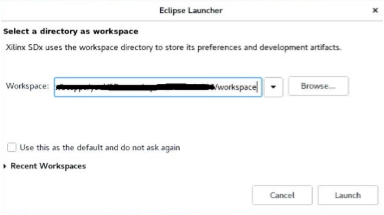  

2. Select a location for your workspace. This is where the project will be located.  

3. Click **Launch**.  
The Welcome window opens. The Welcome window opens when you use the tool for the first time, or by selecting **Help > Welcome**.  
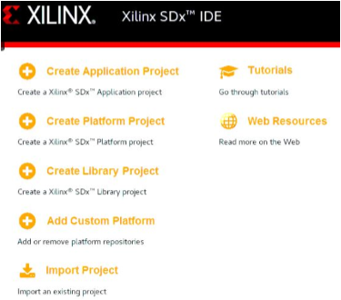  

4. In the Welcome window, click **Create Application Project**.  
The New SDx Application Project dialog box opens.  
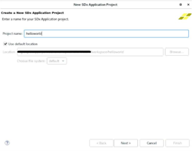

5. Specify the name and location for your project.
   1. In Project Name, enter `helloworld`.
   2. Select **Use default location**.

6. Click **Next**.  
The Hardware Platform page is displayed.  
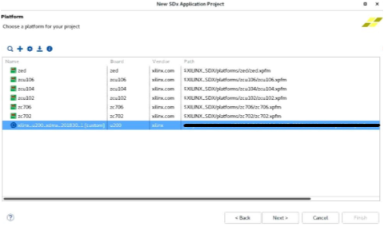

7. Select the `xilinx_u200_xdma_201830_1` platform, and then click **Next**.  
The Templates window opens, showing a list of possible templates that you can use to start building an SDAccel environment project. Unless you have downloaded other SDx examples, you should only see Empty Application and Vector Addition.  
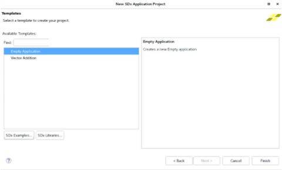

   The selection of the hardware platform defines the project as an SDAccel or SDSoC™ environment project. In this case you have selected an SDAccel environment acceleration platform, so the project will be an SDAccel project.

   In this lab, you will be using the Helloworld example from the GitHub repository. To do this, you need to download the examples.  

8. Click **SDx Examples**.  
The SDx Examples window shows that you can download both the SDAccel Examples and SDSoC Examples.  
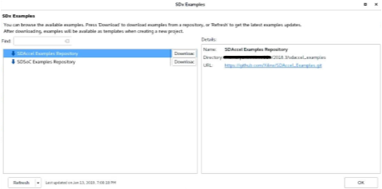  

9. For SDAccel Examples, click **Download**, and the system will begin to clone the Github repository to the location designated in the Details.  
   >**NOTE**: The download can take a long time, depending on connectivity speeds. The Progress Information dialog box is displayed until the cloning of the repository is complete.  

   When the download completes, the SDAccel Examples tree table is populated and expanded.  
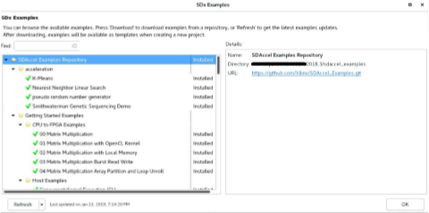  

10. Click **OK** to close the window and go back to the Templates window.  
The Templates window is now populated with the SDAccel Github examples.  Using the Find window, type hello, and then locate the Hello World (HLS C/C++ Kernel) from the Host Examples.  
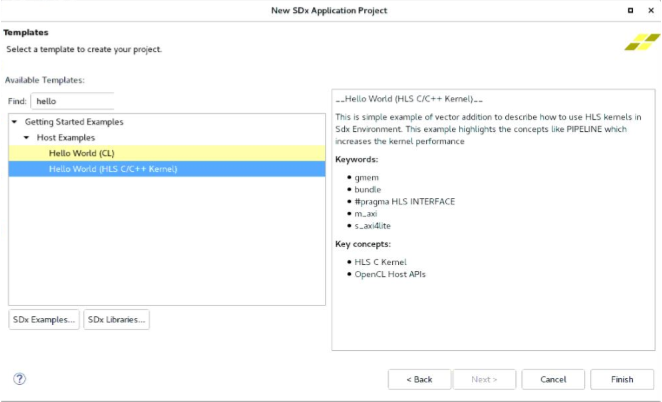  

11. Click **Finish**.  
The _helloworld_ project is created and displayed in the SDAccel environment. The environment should look similar to the following figure.  
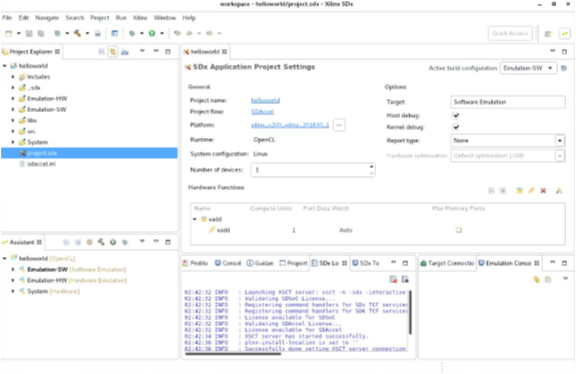

The SDAccel environment includes the Eclipse-based SDx integrated development environment (IDE) that you have been working in. As shown in the figure, the default perspective has an arrangement of the Project Explorer view, Project Editor window, and the Outline view across the top, and the Assistant view, the Console view, and Target Connections view across the bottom. Refer to the SDAccel Environment User Guide ([UG1023](https://www.xilinx.com/cgi-bin/docs/rdoc?v=2018.3;d=ug1023-sdaccel-environment-user-guide.pdf)) for more information on the features of the SDx IDE.

## Step 2: Running Software Emulation

This step shows you how to run software emulation for a design by setting the Run Configuration settings, opening reports, and showing how to launch Debug. You can find details about reports and Debug in the SDAccel Environment User Guide ([UG1023](https://www.xilinx.com/cgi-bin/docs/rdoc?v=2018.3;d=ug1023-sdaccel-environment-user-guide.pdf)).  

1. To run CPU Emulation, go to Application Project Settings, and ensure that **Active build configuration** is set to **Emulation-SW**.  
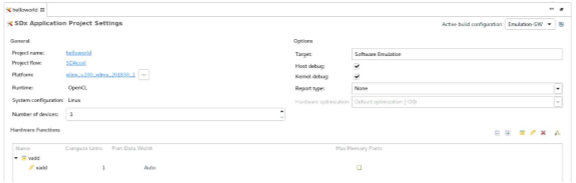  

2. From the GitHub example, an accelerator already exists for the design. To add a hardware function to a design that does not have one, click on the Add Hardware Function button (). This analyzes the C/C++ code and determines functions that can be used for acceleration.  

3. Click (![[the Run Button]](./images/lvl1517357172451.png).  
This builds the project before running the emulation.  
   >**NOTE**: The build and emulation process can take a few minutes or longer to complete. During that, open the Run Configurations dialog box to see how you can add specific command line options to customize your build.  

4. Go to the Run menu, and then select **Run Configurations**.  

   Under the Arguments tab, in the Program arguments field, you can add XOCC command line flags and switches. Refer to the SDx Command and Utility Reference Guide ([UG1279](https://www.xilinx.com/cgi-bin/docs/rdoc?v=2018.3;d=ug1279-sdx-command-utility-reference-guide.pdf)) for a description of command options. In this tutorial, no command line arguments are needed for the design to function.  

5. In the Profile tab, there is a drop-down menu for Generate timeline trace report. You can click on the options to see what types of reports are generated. There is also a box for Enable Profiling in this tab. Close the window without changing anything.  
   >**NOTE**:  If you make changes to the Run Configurations dialog box, in order to see the changes, re-run the current emulation step in order by clicking the **Run** button.  

   The Console window should now display `TEST PASSED`.

6. After the emulation run is complete, you can review the Profile Summary and Application Timeline reports for details on further optimizations. In the Assistant window, double-click Profile Summary as shown in the figure.  
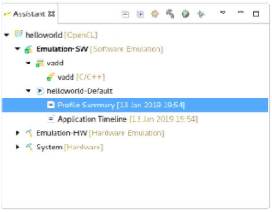

   Here, you can view operations, execution time, bandwidth, and other useful data that you can use to optimize the design. Note that your summary numbers may vary from the following figure.  
   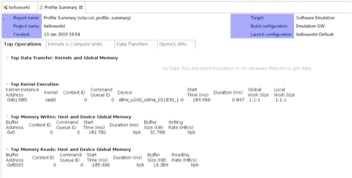  

9. To view the Application Timeline report, in the Assistant window, double-click Application Timeline. This shows a breakdown of the host code and the kernel code, and execution time for each. To zoom in to a specific area, click and drag the mouse to the right.  
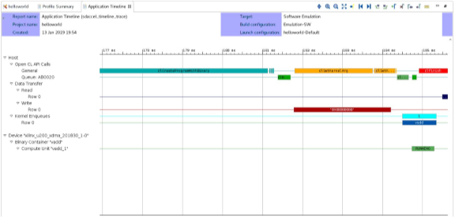  

10. The Profile Summary and Application Timeline present data on how the host code and kernel communicate and process kernel information. Using the Debug feature can help you to step through host-kernel processing to identify issues. In the Project Explorer window, double-click **host.cpp** (located in the `Explorer > src` directory) to open the file in the editor.  

11. To run in Debug, you need to set a breakpoint. Setting breakpoints at key points in the execution helps to identify problems. To pause the host code prior to kernel debug, right-click on (line 89) in the blue area (see figure below) on the (`OCL_CHECK(err, err = q.enqueueMigrateMemObjects({buffer_in1, buffer_in2},0/* 0 means from host*/));`), and select **Toggle Breakpoint**.  
  

1.  To run Debug, click .  
A dialog box opens and displays options to switch perspectives. 

Click **Yes**.  

2. Using Eclipse debugging, you can examine the host and kernel code in more detail. All the controls for step-by-step debugging are in the Run menu or on the main toolbar menu.

3. By default, the debugger inserts an automatic breakpoint at the first line of `main`. On the Debugger tab of the Runs Configuration dialog, there is an option to stop on the `main` function which is enabled by default as shown in the figure. This is helpful in case of a problematic function in need of more thorough debugging. Press **F8** to resume to the next breakpoint or from the Run menu select Resume.  
  

15. After resuming debugging, SDx launches another gdb instance for the kernel code, and it also has a breakpoint at the beginning of the function. This allows for detailed analysis of the kernel and how the data looks being read into the function and written out to memory. Once the kernel execution is done in gdb, that instance is terminated, and you return to the main debugging thread. Press **F8** to continue.  
>**NOTE**  The console view still shows the kernel debug outputs. Click  to go back to the vadd.exe console and see the output from the host code.  

16. Close the Debug perspective by going to the upper-right corner of the window where it shows the Debug () button, right-click, and select **Close**, or use the SDx button () to switch to the standard SDx perspective.

17. After you are in the main SDx Perspective, close all tabs in the center Project Editor window except the Application Project Settings window.

<strong>Step 3: Running Hardware Emulation</strong>

This step covers running the Hardware Emulation feature, as well as looking at the basics of profiling and reports.  

  1. To run Hardware Emulation, go to SDx Application Settings, and ensure that **Active build configuration** is set to Emulation-HW, and then click Run. This takes some time to complete.<!--how long?-->  
     >**:pushpin: NOTE:**  The main difference between Emulation-SW and Emulation-HW is that emulating hardware builds a design that is closer to what is seen on the platform, synthesizing RTL for the kernel code. This means that data related to bandwidth, throughput, and execution time are more accurate. This causes the design to take longer to compile.  

  2. In the Assistant tab, under the Emulation-HW configuration, open System Estimate report. This text report provides information related to kernel information, timing about the design, clock cycles, and area used in the device.

     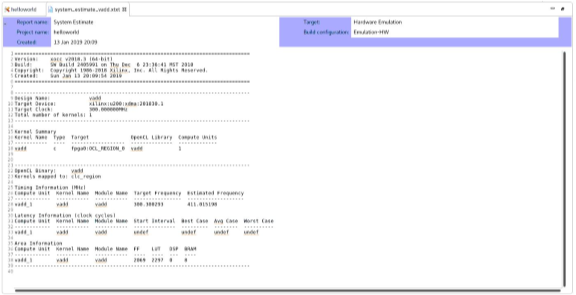  

  3. In the Reports tab, double click to open Profile Summary report. This report provides detailed information related to kernel operation, data transfers, and OpenCL API calls, as well as profiling information related to the resource usage, and data transfer to/from the kernel/host.
     >**:pushpin: NOTE:**  The simulation models used in Hareware Emulation are approximate. Profile numbers shown are just an estimate and might vary from results obtained in real hardware.  

     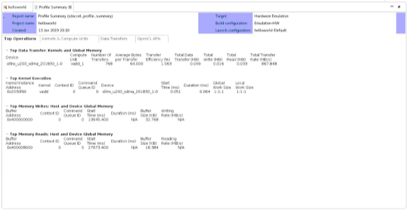

  4. Next to the console tab, there is a tab labeled Guidance. This is where unmet checks provide some information on how to optimize the kernel.

     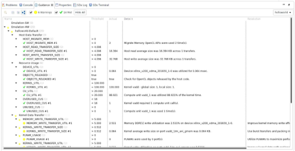  

     >**:pushpin: NOTE:**  To see other performance optimization techniques and methodologies, refer to the  SDAccel Profiling and Optimization Guide ([UG1207](https://www.xilinx.com/cgi-bin/docs/rdoc?v=2018.3;d=ug1207-sdaccel-optimization-guide.pdf)).  

  5. In the Reports tab, double click to open the Application Timeline report. This report shows the estimated time it takes for the host and kernel to complete the task and provides finer grained information on where bottlenecks can be. Adding a marker, zooming, and expanding signals can help in identifying bottlenecks.  

     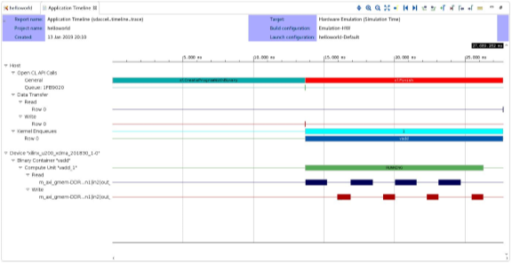  

  6. Open the HLS Report by expanding the Emulation-HW tab and then expanding the relevant kernel tab.
     This report provides detailed information provided by Vivado® HLS on the kernel transformation and synthesis. The tabs at the bottom provide more information on where most of the time is spent in the kernel and other performance related data. Performance data including latency and clock period are also shown in this report.  

     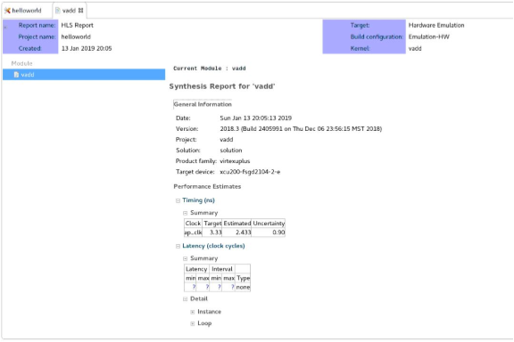  

<strong>Step 4: Makefile Flow</strong>

   This step explains the basics of the Makefile flow and how SDx™ uses it. The advantages of using this flow include:  

   * Easy automation into any system  
   * Faster turnaround time on small design changes  

   To run the makefile flow, do the following:  

   1. In the Project Explorer, navigate to the Emulation-SW directory, and then look for the makefile file. Double-click the file to open it in the editor.  The SDx IDE creates this makefile and uses it for building and running emulations. Alternatively, you can navigate to the Emulation-HW directory and look for the makefile file.  

   2. Notice that there is a unique makefile for each build. In the opened makefile in the editor window, look at line 21. Note that it specifies a target if either `hw_emu` or `sw_emu`.   

   >**:information_source: TIP:** You can also use the makefile produced by the SDx IDE to build the project outside of the GUI.   

   3. Open up a new terminal session and navigate to the workspace.

   4. Navigate to the Emulation-SW directory and type: `make incremental`. The process produces a typical SDx log output.  

   >**:pushpin: NOTE:** If no changes are made to the host or kernel code, this will do nothing because the compilation is already completed. It will output a warning like: make: Nothing to be done for `incremental`.  

[Lab 2: Introduction to the SDAccel Makefile](./lab-2-introduction-to-the-sdaccel-makefile.md) goes into more detail on how to use the makefile and command line flow.  

### Summary

After completing this tutorial, you should be able to do the following:  

* Create an SDAccel environment project from a Github example design.
* Create a binary container and accelerator for the design.  
* Run Software Emulation, and use the Debug environment on host and kernel code.  
* Run Hardware Emulation, and use the reports to understand possible optimization.  
* Understand the differences between Software and Hardware Emulation reports.  
* Read the project makefile and run the makefile command line.  

  

  
Copyright&copy; 2018 Xilinx

